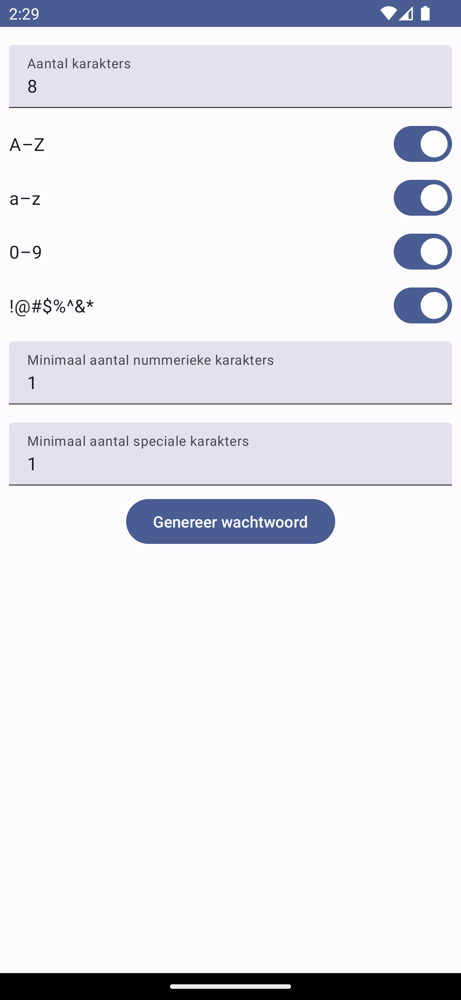

# Taak Wachtwoord Generator

## Beschrijving

Schrijf een mobiele applicatie die op basis van parameters een wachtwoord genereert.

### Basis

De basis applicatie vraagt de gebruikers een aantal karakters. Dit aantal moet een getal zijn tussen 2 en 100.
Vervolgens kan de gebruiker kiezen uit 4 karaktersets:

- hoofdletters => A tot en met Z
- kleine letter => a tot en met z
- cijfers => 0 tot en met 9
- speciale karakters => !, @, #, $, %, ^, &, \, \*

Deze kunnen naar keuze gecombineerd worden. Wanneer alle karaktersets uitgeschakeld worden, worden de kleine letters automatisch weer aangezet.

De knop genereer wachtwoord, genereert een wachtwoord op basis van de ingestelde parameters.

De genereer wachtwoord knop mag enkel beschikbaar zijn wanneer het aantal karakters correct is.

### Uitbreiding

Bij het genereren van een wachtwoord kan je ook rekening houden met een minimaal aantal karakters per karakterset.

Voeg 2 velden toe waardoor rekening wordt gehouden met een minimum aantal numerieke karakters en met een minimum aantal speciale karakters.

De som van deze 2 parameters (aantal karakters) moet steeds 2 minder zijn dan het totaal aantal karakters. Met andere woorden wanneer het aantal karakters 8 is, kan de som van het minimaal aantal karakters maximaal 6 zijn.
Er wordt geen rekening gehouden met het minimaal aantal karakters wanneer deze karakterset niet gekozen is.

Maak de knop genereer wachtwoord onbeschikbaar wanneer 1 van de velden een fout bevat.

## Layout

Maak een layout gelijkaardig aan de screenshot.

Deze schreenshot is inclusief uitbreidingen (wanneer je de uitbreiding niet maakt dan hoeven deze velden niet aanwezig te zijn)

## Technische vereisten

- Maak gebruik van meerdere composables
  - De combinatie van een TextView en een Switch **MOET** in een aparte composable
- Maak gebruik van state hoisting
- Splits code op in functies waar nodig

### Extra info uitbreiding

Voor de uitbreiding met de velden voor minimale karakters kan je best een nieuwe composable maken.
Deze composable zou onderstaande parameters kunnen bevatten:

- value => om de huidige waarde te displayen
- onValueChange => een lambda functie om de nieuwe waarde in te stellen (enkel wanneer dit een geldige integer is)
- onErrorChange => een lambda functie om door te geven of het veld nog errors bevat of niet
- label => tekst label om te tonen
- min => minimum integer die ingevuld mag worden
- max => maximum integer die ingevuld mag worden
- ignore => een boolean die aangeeft of het veld genegeerd mag worden. Zorgt ervoor dat er geen error getoond wordt en het veld onbruikbaar wordt.

## Beoordeling

### Basis

| Topic                                                                                                       | Maximale score (12 punten) |
| ----------------------------------------------------------------------------------------------------------- | -------------------------- |
| Mogelijkheid om wachtwoord te genereren voor het ingestelde aantal karakters                                | 1                          |
| Aangevinkte karaktersets worden gebruikt in gegenereerd wachtwoord                                          | 2                          |
| Automatisch aanvinken van minstens 1 karakterset                                                            | 2                          |
| Error state voor foutieve input aantal karakters                                                            | 1                          |
| Button disabled bij invalid input                                                                           | 1                          |
| Code is geschreven zoals verwacht (gebruik functies, composables, state hoisting, gebruik string.xml files) | 5                          |

### Uitbreiding

De uitbreiding wordt enkel gequoteerd wanneer de basis features (topic 1 t.e.m. 5 van de basis beoordeling) in orde zijn.

| Topic                                                                                            | Maximale score (4 punten) |
| ------------------------------------------------------------------------------------------------ | ------------------------- |
| Velden minimale karakters zijn aanwezig en worden gebruikt om het wachtwoord te genereren        | 2                         |
| Error state + disabled button bij invalid input (aantal karakters - som(minimale karakters) > 2) | 1                         |
| Minimale karakters worden niet meegeteld wanneer karakterset niet geselecteerd is                | 1                         |

## Voorbeeld

Wil je de app zelf eens proberen installeer deze [apk](app.apk). Je kan de apk op je toestel downloaden en installeren. Of je kan deze apk in een emulator scherm slepen, deze wordt dan geïnstalleerd.
